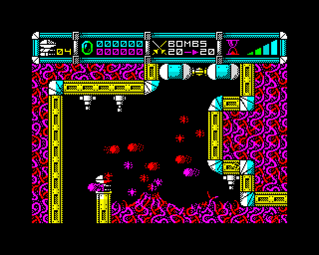
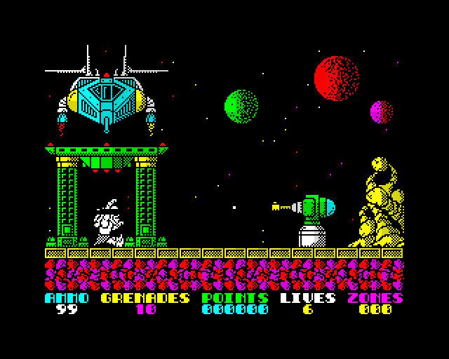

# zx-emulator

A cycle-accurate **ZX Spectrum 48K / 128** emulator, written from scratch in Rust. It runs as a
native desktop app and in the browser, loads real games from tape with the real loading sound,
and proves its timing against measurements taken from real hardware.






Every pixel above is the emulator's own output, enlarged 2× and otherwise untouched — a checker
verifies that no image contains a colour the machine cannot emit
([`docs/images/README.md`](docs/images/README.md)).

## What it is

- **The whole machine**: Z80 CPU core, ULA video with contended memory, beeper and AY-3-8912
  sound, keyboard, 48K and 128 memory models with ROM/RAM paging.
- **Real media**: `.tap` and `.tzx` tapes loaded by the real ROM's own loader — turbo loaders
  included — plus `.z80` and `.sna` snapshots, both directions.
- **Two front ends, one core**: a desktop window and a WASM build served from a URL, sharing the
  loader, keymap and render path. Audio is resampled to the device with drift correction.
- **Not a port.** No code, opcode tables or timing tables from other emulators; behaviour comes
  from hardware documentation and is then proven against external conformance suites.

## Quick start

Rust 1.98+ (stable is pinned by `rust-toolchain.toml`). The Sinclair ROMs are committed under
[Amstrad's permission](testdata/README.md); games are never committed — put your own in
`testdata/games/` (gitignored).

```bash
# A 48K in a window, booting to (c) 1982 Sinclair Research Ltd.
cargo run --release --manifest-path crates/frontend/Cargo.toml --bin zx -- testdata/roms/48.rom

# A 128: two ROMs, editor first. A tape goes on the same command line.
cargo run --release --manifest-path crates/frontend/Cargo.toml --bin zx -- \
    testdata/roms/128-0.rom testdata/roms/128-1.rom testdata/games/your-game.tzx
```

Loading a tape is what it was in 1983: type `LOAD ""` (`J`, then `Ctrl`+`P` twice), `ENTER`,
then `F3` to press PLAY — on a 128 just `ENTER` on the boot menu, then `F3`. Then wait: the
border stripes are the ROM decoding bits, in real time, with the real sound.

```bash
# In a browser (file:// will not work — the page must be served over HTTP):
sh web/build.sh
cd target/web && python3 -m http.server 8000    # then open http://localhost:8000/
```

Browser sound starts on the first click or keystroke — browsers suspend audio until then.

```bash
cargo test --workspace --no-fail-fast           # the full suite and every gate
```

Keys, snapshots, drag-and-drop, the `F7` joystick schemes, the headless `zx-shot` camera, and
every caveat: **[`docs/RUNNING.md`](docs/RUNNING.md)**.

## The hard parts

- **Cycle-exact timing and contended memory.** The ULA steals bus cycles from the CPU in a
  pattern that games rely on. The model is graded against 70 rows measured on real Spectrums —
  0 disagree — and the border effects that depend on sub-frame timing come out right.
- **Undocumented Z80 behaviour.** The flag bits and phantom registers no datasheet fully
  specifies, exercised by `zexall` and by 1045 per-instruction hardware-derived test vectors.
- **Tape formats and turbo loaders.** `.tzx` timing margins are far tighter than the ROM
  loader's; R-Type's 9.5-minute turbo cassette is the harshest test here and it loads.
- **Real-time audio on two platforms without glitches.** Emulator clock and sound card clock
  disagree; the fix is a closed control loop that trims the resample rate instead of dropping
  frames, on the desktop and in a browser worklet.
- **A hot path that stays fast under `overflow-checks = true`.** The checks stay on in release
  as a correctness rule, so every hot-loop instruction has to earn its place — measured in
  `crates/spectrum/benches/frame.rs` and held by a gate.

## The work, in order

| Stage | What landed |
|---|---|
| Z80 core | Registers, flags, every prefix; FUSE vectors **290/290**, then **1045/1045**; `zexdoc` and `zexall` **67/67** |
| The 48K machine | Memory map, ULA, keyboard, 50 Hz interrupt — boots the real ROM on frame 87; contention graded against hardware measurements |
| Snapshots and tape | `.z80`/`.sna` both directions; `.tap` loaded by the real ROM through the `EAR` bit |
| The 128 | ROM/RAM paging, AY-3-8912, the beeper, per-bank contention |
| The browser | `wasm32` build; a served page booted at 50.3 Hz with 0 dropped frames, snapshots round-trip through download and drop |
| After release | Tape audio made audible, turbo `.tzx` loaders, and the performance campaign below |

The full milestone table, with every correction argued in place: [`docs/JOURNAL.md`](docs/JOURNAL.md).

## How it differs from other emulators

The engineering culture is **honest evidence** — every claim is graded by something that can say
no, and the misses stay on record:

- **Timing is proven, not tuned.** FUSE hardware-derived vectors (290/290 unprefixed,
  1045/1045 full), `zexall` 67/67 including undocumented flags, and a 70-row contention oracle
  measured on real machines — with the limits of each green stated next to it.
- **The documentation is machine-graded.** `crates/testsupport/tests/cited_lines.rs` and
  `cited_names.rs` walk every `path:line` citation and every named test in the docs; a test
  fails if a doc lies. Corrections are made loudly in place, never silently.
- **The hot path is defended.** Zero per-frame allocation, no trait objects on the execute
  path, bounds checks provably elided, benchmarks in `crates/spectrum/benches/frame.rs`, and a
  performance ceiling in `web/gate.sh` that goes red on regression.
- **Overflow checks stay on in release.** The Z80 is meant to wrap, so every wrap is an
  explicit `wrapping_*` call and a silent one is a bug the build refuses to hide.
- **Screenshots are evidence.** The machine can emit exactly fifteen RGB values; a checker
  rejects any published image containing a sixteenth.

The full rules, and the audit of this repository's own false citations:
[`docs/JOURNAL.md`](docs/JOURNAL.md), *Engineering rules*.

## Performance work, measured

Post-release audits over the whole workspace. Every number below has its measurement recorded in
[`docs/JOURNAL.md`](docs/JOURNAL.md).

| Change | Effect |
|---|---|
| Tape-edge reporting instead of a per-tick probe | erased a **+23%** frame-time regression the tape fix had shipped (150.8 → 180.3 µs, back to 146.1 µs) |
| Contended-memory lookup: derived cache | 10 instructions → 4 per test; `quiet_48k` **143.4 → 138.8 µs (−3.2%)** |
| AY envelope position masked to its range | up to **1.33 M** compare-and-branch pairs/sec and three panic pads removed |
| Browser worklet: preallocated ring buffer | bounded audio latency; no per-chunk allocation on the audio thread |
| Desktop audio queue: one bulk `extend` | audio-mutex critical section **~100× shorter** (~99% of hold time gone) |
| ROM acknowledgement scan behind `LazyLock` | a whole-ROM scan 60×/sec → **once** per process |
| Resampler control-loop sign fix | 8.9 s of runaway backlog over 20 min of drift → **74 ms**, stable; closed-loop tests added |
| `tape_playing_48k` benchmark + gate ceiling | the hole that let the +23% ship green is an instrument now; regressions go red before push |

## Where it is now


**R-Type loads and runs** — a `.tzx` turbo loader, 28,429 frames of emulated cassette (nine and
a half minutes), into its attract loop. Manic Miner, Cybernoid, Cybernoid II and Exolon load
from tape and play. The workspace suite is **1045 tests, 0 failed**, and it runs on the desktop
and in the browser.

Honestly still open: a handful of recorded items in [`docs/STATUS.md`](docs/STATUS.md)'s
register — the one place open items live. The largest of them, the tape sitting quieter than
the beeper under a shared mixer ceiling, was closed on this branch by giving the tape its own
level outside the game mix.

## Documentation

| Document | What it holds |
|---|---|
| [`docs/RUNNING.md`](docs/RUNNING.md) | The full guide: every command, key, format and caveat |
| [`docs/JOURNAL.md`](docs/JOURNAL.md) | The engineering journal: galleries, milestones, the post-release sound and performance work, the rules |
| [`docs/ARCHITECTURE.md`](docs/ARCHITECTURE.md) | Crate boundaries, design decisions, measured codegen claims |
| [`docs/MACHINE.md`](docs/MACHINE.md) | The machine model and the timing oracle |
| [`docs/Z80-REFERENCE.md`](docs/Z80-REFERENCE.md) | The CPU reference, undocumented corners included |
| [`docs/STATUS.md`](docs/STATUS.md) | What is currently true, and the register of what is open |

Claims in these documents are labelled by the kind of evidence behind them — proven, measured,
derived, or observed — and a stale claim is a defect report, not a tidy-up.

## Licence

MIT OR Apache-2.0.

**Amstrad have kindly given their permission for the redistribution of their copyrighted
material but retain that copyright.** The Sinclair ROMs are committed on the strength of that
permission — quoted in full, with its conditions, in [`testdata/README.md`](testdata/README.md).
Game images are never distributed here; they are yours to supply.
