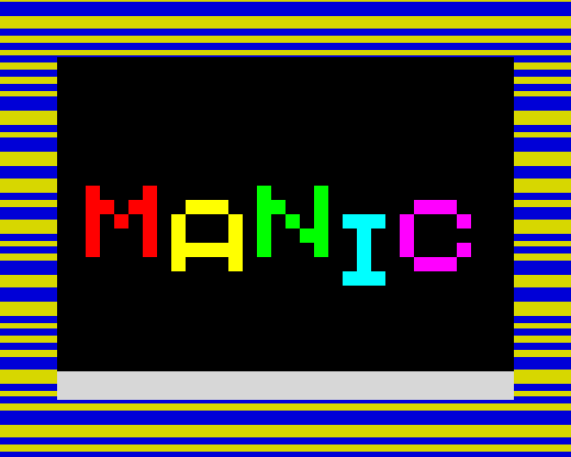
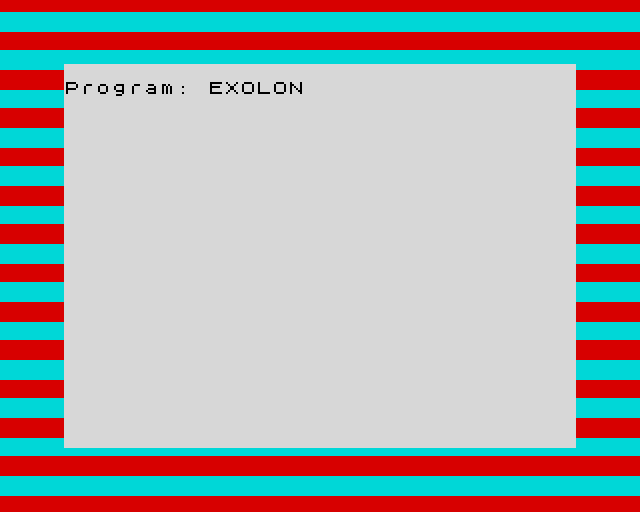
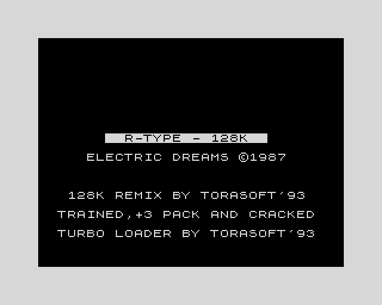
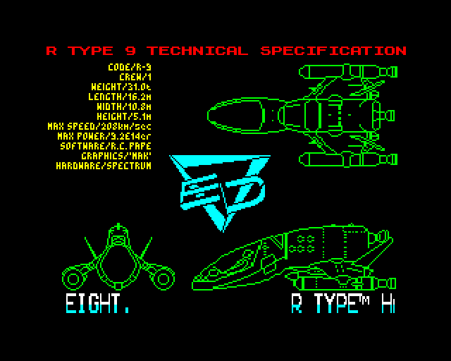

# The engineering journal

The long-form record that was `README.md` until 2026-09-03: the game galleries, the
milestone table with every correction argued in place, the post-release sound and
performance work, and the rules the documents are written under. The README keeps the
short form; nothing recorded was dropped in the move. The full running guide is
[`docs/RUNNING.md`](RUNNING.md).


---

## The game at the front door


**_Cybernoid_, playing, on the 128.** The game arrives as a `.z80` snapshot, which lands *before*
the first frame runs — and that is what makes this a picture of a game being played rather than of
a menu: `1`, *START GAME* on the game's own screen, could be pressed through the same keymap table
the window uses. The 600 frames after it are the game running with nobody at the keyboard, so
every enemy on screen is where the game put it.

> **Every pixel of every image here is the emulator's output, enlarged by 2 and otherwise
> untouched** — `Spectrum::render` into a `Frame`, then `palette::write_rgba`, which is the path
> the window runs. There is no surround, no caption and no margin in any file, so *"which pixels
> are the machine's"* is not an argument but a program: `Colour::rgb` can emit exactly **fifteen**
> RGB values, so anything else in a file is foreign and a checker decides it. The checker was
> broken on purpose **three** times to show it can say no — most recently with a colour whose every
> channel is legal and whose *combination* is not, which the two earlier breaks would have missed.
> [`docs/images/README.md`](images/README.md) has the commands, the checker and the breaks.


---

## Why this project

Not a port. Not a translation of an existing emulator. The CPU is implemented from the Z80
hardware specification and from our own architecture; correctness is then proven against
public conformance suites rather than against somebody else's source.

Emulating a Z80 is a rare kind of engineering problem: the correct answer is not a matter
of opinion. `zexall` either prints `OK` for all 67 tests or it does not. That makes it an
honest way to exercise the parts of Rust that matter — exhaustive `match` over an
instruction set, types that make an invalid state unrepresentable, and property tests over
arithmetic — with an external oracle instead of self-assessment.


---

## Three more games


**_Manic Miner_, playing, on a 48K, and it got there the long way.** `LOAD ""` typed through the
same keymap table the window presses, then the tape played, then the ROM's own `LD-BYTES` read all
six blocks off it — about three minutes of emulated time. **Nothing was pressed afterwards, and
nothing could have been:** `zx-shot` presses every key *before* it starts the tape. This is one
stop on the game's own attract loop, which tours the caverns while the title screen waits for an
`ENTER` that never came.


**_Cybernoid II_, half-arrived.** This screen was on the tape *as a screen*: one block carrying no
header and exactly **6,912** bytes — 6,144 of pixels and 768 of colour, which is what a Spectrum
has. The border is still striped because the other **40,191** bytes have not landed yet. Those
stripes are the ROM's loader toggling the border as it decodes each bit, so they come out like
this only if the border is modelled *below* frame resolution; written once per frame it would be a
flat rectangle.


**_Exolon_, whose picture was never on the tape.** Its three files are 125 bytes of BASIC and two
blocks of code, for addresses 27000 and 28000 — nothing 6,912 bytes long, nothing aimed at the
display file. **The picture is painted by code**, and 100 frames earlier it can be caught
half-drawn with a *black* border, which is the tell: the ROM's loader never leaves the border
alone. Here it is finished and the border is red and cyan — the ROM listening for the next block's
pilot tone, which is a different part of `LD-BYTES` from the blue and yellow above.

![Exolon being played: a black starfield carrying a green planet, a large red one and a small magenta one, a white and cyan lander hanging above a green pillared arch at the left, an armoured figure in white standing beneath the arch on a yellow tiled ledge, a green gun emplacement to the right of centre with a small shot in the air beside it and a yellow rock formation behind it, a band of red and magenta rubble below the ledge, and the game's own status line across the bottom reading AMMO 99, GRENADES 10, POINTS 000000, LIVES 6, ZONES 000.](images/exolon-playing.png)

**_Exolon_, started — by a key pressed the better part of four minutes after the tape began.** Every
`--keys` tap happens *before* PLAY, so nothing here could reach a game that arrives that much later;
`--keys-after` presses once the tape has run out instead. It does not count frames to know when —
**it asks the tape.** `Tape::pulses` half-periods are T-states, their sum is the cassette end to end, and dividing
by the machine's own frame length gives the wait: 10,653 frames here, against a tape that ran out at
10,953. Then `Space;Space;Key1` — dismiss, advance, `1 START GAME`. **`LIVES 6` is the honest
detail:** nobody is at the keyboard, so the hero stands under that gun and dies about every four
seconds, and `6` is where the counter had reached 800 frames after `1`.


**_Cybernoid II_, the same three taps, and the evidence is the scoreboard.** `000025`, up from
zero — a still of a title screen and a still of a running game are hard to tell apart, and a score
that has moved is the difference. The sequence is uniform because what it walks is uniform: a Hewson
loading screen and a Hewson title screen each consume one key, and only the third is a choice.
`Key1;Key1;Key1` starts both games too, which is what identifies the first two as *advance* rather
than as *select* — so neither picture required knowing anything about either game in advance.

> **No game is distributed by this repository** — `testdata/**` is `.gitignore`d and no game file in
> `testdata/games/` is committed. *Manic Miner* is Matthew Smith's, published by Bug-Byte Software
> Ltd in 1983; *Cybernoid*, *Cybernoid II* and *Exolon* are Raffaele Cecco's, published by Hewson
> Consultants Ltd in 1987 and 1988. **No permission covering these screenshots was found for any of
> them.** For *Manic Miner*, two archives sharing one dataset contradict each other about this exact
> file. For the three Hewson titles something better exists and is still not that: an archive
> relays the publisher's *"no objection"* to **its own** downloads, which is not a permission for
> screenshots taken by somebody else. [`docs/images/README.md`](images/README.md) states all of
> it in full, with the quotations, and separates it from the 128 menu below — which *is* covered, by
> Amstrad's quoted ROM permission.


---

## The other machine, and the three minutes before a game appears

The 128 first, then the tape a game arrives on, then what arrived — which is the order they have
to happen in. All three are `zx-shot` output at scale 2, whole frames, nothing added.


**The 128's own boot menu, unassisted.** The number of `--rom` arguments is what names the
machine — two make a 128, editor ROM first — so this needed no `--model` flag and no key at all.
The rainbow is the machine's signature and it is drawn by the ROM, not by anything here.



**Three thousand frames into the tape.** Two things are worth naming. The stripes are the ROM's
`LD-BYTES` toggling the border as it decodes each bit, so they come out right only if the border
is modelled *below* frame resolution — written once per frame it would be a flat rectangle. And
`MANIC` is not a bitmap: it is 256 bytes loaded straight into the attribute file at `0x5900`,
which is why the letters are 8 × 8 blocks of flat colour.


**What the tape produced.** The same four keys, 7,750 frames later. The cavern above is one stop
on the attract loop this screen starts when the `ENTER` it is asking for does not arrive — and it
cannot arrive, because `zx-shot` presses every `--keys` tap *before* it starts the tape. **That
ordering was also the limitation, and it named its own remedy.** *Exolon* and *Cybernoid II* have
no attract loop to photograph, so for as long as every key landed before PLAY they could be shown
arriving and not playing; [`docs/images/README.md`](images/README.md) recorded that as a
missing flag rather than a defect, and `--keys-after` is that flag. The two frames above are what
it bought, taken the same day. That page keeps the prediction standing rather than deleting it —
together with the two games that were tried and left out, and why a picture nobody can regenerate
would not have been worth having.


---

## The bar

**The bar:** the emulator is not "done" until `zexall` passes — including the undocumented
flag behaviour that most emulators quietly skip.

> **What that green proves is narrower than the sentence reads, and this repository measured the
> gap rather than assuming it.** `zexall` reports 67/67 (M4), and it genuinely **is** sensitive to
> the undocumented `F3`/`F5` bits — forcing them to a constant `0` or `0x28` fails it, while a
> control mutation of a *documented* bit fails both exercisers, which is what proves the group is
> executed rather than skipped. But `zexall` **cannot decide the rule behind those bits**: the same
> 67/67 has been observed under three different implementations, including one whose flag latch was
> stuck at zero. Two FUSE vectors are the only gate in this project that can see that latch at all.
>
> So the bar is necessary and not sufficient, and the tempting one-line summary — *"`zexall`
> passes, so the undocumented flags are right"* — is true of the first claim and false of the
> second. [`docs/STATUS.md`](STATUS.md) holds the coverage table that keeps them apart.


---

## Status

| Milestone | Goal | Gate | State |
|---|---|---|---|
| M1 | Registers, flags, un-prefixed opcodes | FUSE vectors green for un-prefixed | **290/290** — merged |
| M2 | `CB` / `ED` / `DD` / `FD` prefixes | FUSE vectors green in full | **1045/1045** — merged |
| M3 | Documented behaviour | `zexdoc` passes | **67/67 first run** — merged |
| M4 | Undocumented flags | **`zexall` passes** — CPU complete | **67/67**, made a gate with its limits stated — merged |
| **M5** | Spectrum 48K: memory map, ULA, keyboard, 50 Hz interrupt | boots to `© 1982 Sinclair Research Ltd` | the machine boots, **on frame 87**, and **the gate work landed**: `crates/spectrum/tests/boot.rs` is a real `#[test]` that runs the ROM under `cargo test` and asserts the frame, alongside the other integration gates in that directory. Of the five mutations, **four were already red and one survived**. **Contention is no longer ungraded either**: `crates/spectrum/tests/timing_oracle.rs` grades the model against **70 rows measured on real Spectrums, 0 disagreeing**. See [`docs/STATUS.md`](STATUS.md) for what M5's green does and does not mean, and [`docs/MACHINE.md`](MACHINE.md) for the oracle's scope, which is narrower than the sentence sounds |
| **M6** | Snapshots (`.z80` / `.sna`) and tape (`.tap`) | **T1 + T2 + T3** — *not* "a real game runs" | **merged.** A program written here, stored as a `.tap`, loaded by the real ROM's own `LD-BYTES` through the `EAR` bit, and executed — computing a value asserted to appear **nowhere in its own bytes**, so that *"the data arrived"* and *"it ran"* are separate claims. Design in [`docs/M6.md`](M6.md); what it opened and closed is in [`docs/STATUS.md`](STATUS.md) |
| M7 | 128: paging, second ROM, AY-3-8912, **the beeper**, per-bank contention | **T1 + T2 + T3** — *not* "128-only software runs" | design in [`docs/M7.md`](M7.md). **All five parts have landed**, each with its own gate among `crates/spectrum/tests/m7_*.rs`. **The memory half boots:** the 128 reaches its own `© 1986` copyright, draws all five menu entries, the highlight moves under `CAPS SHIFT`+`6`, and selecting *48 BASIC* reaches the `© 1982` message through ROM page 1 — the year changing is what makes that a claim about which ROM is executing. **The sound half is a device rather than a plan:** `crates/spectrum/src/ay.rs` is the AY-3-8912, reached from a guest's own `OUT`/`IN` in `m7_ay_ports.rs` and followed into the sample stream by `m7_ay_stream.rs`, and the beeper is bit 4 of a `0xFE` write, graded by value against a T-state derivation in `m7_beeper.rs`. What none of that settles is whether it **sounds** right — nobody has listened, and *What this is like at the moment* in `docs/RUNNING.md` says so first |
| M8 | WASM build | **T1 + T2 + T3** — a *build* gate, and ~~"playable from a URL"~~ cannot be one | **the browser build runs.** `wasm32-unknown-unknown` links, and on 2026-09-01 a served page booted the 48K to `© 1982 Sinclair Research Ltd` at **50.3 Hz, 0 dropped**, built a **128** from the query string alone, saved a `.z80` through a `Blob`, and restored it from a file dropped back onto the page. Each observation is recorded with its provenance in [`web/README.md`](../web/README.md). Also landed: `crates/page` (the whole `unsafe` surface of this workspace, five blocks — `EXPECTED_BLOCKS` in `crates/page/tests/unsafe_inventory.rs`), a `bundled` feature that compiles a ROM and a game into one artefact, and drag-and-drop on both targets. Design in [`docs/M8.md`](M8.md) |

> **Two corrections to the rows above, both made 2026-09-01 rather than left to be inferred from
> the design documents.**
>
> **The beeper joined M7 and left M8.** `docs/M6.md` had assigned *Sound — the speaker bit of a
> `0xFE` write* to M8, and `docs/M7.md` said in three places that M8 owned the audio device and
> the beeper with it. **The AY is a 128 device and the beeper is a ULA feature, so both are the
> machine's** — decoded by the same `Ula::out_port` that already takes the border out of the same
> byte — and `crates/spectrum` is where the machine is modelled. **What M8 owns is routing audio
> the machine already produces to a browser's audio device**: the mix, the resampling, the device.
> Four rows were corrected with the originals struck; `docs/M8.md` Decision 9 carries the ruling.
>
> **M8's gate is a build gate and the row's *"playable from a URL"* cannot be one.** *Playable* is
> not a property of an artefact — it is a property of a browser rendering a canvas, a GPU
> compositing it, a keyboard delivering keys and a person forming an opinion — so no corpus and no
> licence makes it automatable. This is the **third** milestone row corrected this way, and the
> reason differs from M6's and M7's: theirs were unautomatable because a corpus could not be
> committed, which another repository could fix, and M8's is unautomatable structurally.

> **Correction — the M5 row said *"the gate work is unfinished: five mutations leave it green and
> nothing yet runs it"*, and the repository falsifies both halves.** It is corrected loudly rather
> than quietly bumped, because how it survived is worth more than the row.
>
> *"Nothing yet runs it"* was already false when it was written. `crates/spectrum/tests/boot.rs` is
> a committed `#[test]`, landed with the M5 gates; `docs/STATUS.md` closes the item in as many
> words — *"nothing runs the boot gate — `crates/spectrum/tests/boot.rs` runs it."*
>
> *"Five mutations leave it green"* was never a verdict about a run that happened. Those mutations
> were graded against `crates/spectrum/examples/boot.rs`, which `cargo test` **builds and never
> calls**. Re-measured against the pre-gate lib target, **four of the five were already red** — 5,
> 7, 1 and 13 failing unit tests inside `src` — and **one survived**, the contention-phase
> off-by-one.
>
> **The propagation is the finding.** The pass that fixed the figure gives a whole section to *"a
> derived figure repeated across documents acquires authority it never earned"*, and states that
> the wrong number had spread into three documents. `docs/STATUS.md` and `docs/MACHINE.md` each
> carry a correction of it. This file did not — the repository's front door, and the only document
> a newcomer reads first. **The section diagnosing the propagation missed a copy of the thing
> propagating, and the copy it missed was the most-read one.**
>
> The rule that follows is cheap and absolute: *a correction is not landed until you have grepped
> for every other copy of what you corrected.* Every fact in these documents costs seconds to
> sweep across `docs/`, `README.md`, `CHANGELOG.md` and `testdata/`.
>
> > **Correction — this paragraph said the sweep *"did not come back clean"* and named
> > `docs/MACHINE.md:358` as still asserting *"five mutations left it green"*. Both halves are
> > false, and the second was pointed at the wrong line.** Re-swept 2026-09-01:
> > `grep -rn "five mutations" docs/ README.md` puts `MACHINE.md`'s only two hits at **`:616`**,
> > which states *"four of five mutations were already red"*, and **`:628`**, which is the block
> > retracting the old wording. `docs/MACHINE.md:358` is prose introducing the timing oracle and
> > has nothing to do with mutations. **The file this note was holding open had already closed
> > it** — so the note outlived the defect it named. That is the same failure one turn later: a
> > correction can go stale exactly as a claim can, and it is the harder one to catch, because it
> > wears the costume of a fix.
>
> **The row above deliberately carries no gate count**, and that is not vagueness — it is the same
> lesson applied one step earlier. That integer moved repeatedly on 2026-09-01 while this was
> being written — `docs/MACHINE.md` records the trail — so any number here would have been stale
> before the sentence containing it was, which is this exact defect for the third time.
> **Count the directory: the command below is the answer, and no integer written beside it can be.**
>
> ```sh
> ls -1 crates/spectrum/tests/*.rs | wc -l
> ```
>
> > **This is where that rule was broken by the paragraph teaching it.** The text above used to
> > carry the integers the command had returned that morning, plus a count of how many were
> > committed, and then asserted that *"`docs/MACHINE.md`'s milestone table says seven gates …
> > and is the number to check first."* Every one of those was stale within the day, and the
> > `seven gates` claim was already false when written — a nested note three lines below it said
> > so, so this file contradicted itself on screen and sent the reader to the wrong document.
> > `MACHINE.md`'s M5 row carries the command, not an answer. `grep -rn "seven gates" docs/`
> > now finds the live copies in **`docs/STATUS.md`**, in its M5 headings; those are that file's
> > to correct and are named here so they cannot go quiet.

> **Correction — the M6 and M7 rows said *"a real game runs"* and *"128-only software runs"*, and
> both name tier T4.** M6 has since merged; the row is corrected rather than quietly widened.
>
> [`docs/M6.md`](M6.md) Decision 8 splits the milestone's evidence into four tiers: **T1**
> proven and corpus-free (the round trips, the truncation sweep, the codec property tests, the
> hand-transcribed vectors), **T2** measured (the real ROM's `LD-BYTES` loading a synthetic tape
> through the `EAR` bit), **T3** measured (a program *we wrote*, loaded from tape by the ROM and
> executed), and **T4** *observed* — a real game, a file of ours opening in somebody else's
> emulator. **The gate is T1 + T2 + T3.** T4 cannot be automated in a repository that may not carry
> games, and a milestone gated on it would be a gate that runs nowhere — which
> [`docs/STATUS.md`](STATUS.md) records this project shipping three times already.
>
> **The residue is not absorbed:** T4 is the only tier that grades a turbo **game** or a program
> written by somebody who did not know how this emulator works, and it runs nowhere. It was written
> here as the only tier grading a turbo *loader*, and that half has since been shrunk rather than
> removed: `crates/spectrum/tests/tzx_turbo_load.rs` grades the loader, and it commits precisely
> because this repository wrote both the tape and the loader that reads it. What cannot be
> committed is the game. That is a row in the register, not a footnote here.
>
> `docs/MACHINE.md` and `docs/ARCHITECTURE.md` carry the same table; both are corrected. The README
> was the copy that was missed the last time a milestone row was corrected, which is why it was
> checked first; the table lives here now.


---

## After the release — the work that came from listening

The milestone table above ends at M8 and every row in it is a build gate, a corpus or a boot
message. **None of them can hear.** `crates/frontend/src/audio.rs` has said so since M8 in the one
row of its own table that matters — *"**That it sounds right** — **nothing.** There is no oracle for
a tune"* — and that row is where this section comes from. The machine was finished, the gates were
green, and then somebody put headphones on.

Two defects came out of that, reported together on 2026-09-03. Neither was a wrong number and
neither was caught by any gate, because both were a **missing connection** rather than a bad
calculation — the class a green suite is structurally unable to find.

**Fixing them produced two more, and those are the interesting ones.** The repair for the silent
tape cost 23% of a frame; the repair for the clicking shipped with its control loop inverted. Both
passed every gate that covered them. They are in the table below with the originals rather than
above it, because a section that recorded only the defects somebody else caused would be the same
kind of document this project spends its comments arguing against.

| # | What was heard | What it actually was | State |
|---|---|---|---|
| **S1** | A tick through the music every few seconds | Frames of audio being **discarded** whenever the queue passed its ceiling | **fixed** — the rate is corrected instead, `Resampler::track` |
| **S2** | Loading a tape was silent | The `EAR` line reached the CPU and **nothing else** — no path to the speaker existed | **fixed** — `Sample::tape`, mixed in the frontend |
| **S3** | The tape, once audible, was too quiet | `TAPE_GAIN` was ruled at `0.5` by reasoning, and measured at 2.5% of full scale against the beeper's 12.9% | **fixed** — subsumed by S4: the ceiling that held the tape at `0.9` died with the shared denominator |
| **S4** | — | Every source divides by one shared `FULL_SCALE`, so loudness given to the tape is **taken from the beeper**. At `TAPE_GAIN = 2.0` a lone beeper fell to 34.6% of the mix and the clipping gate failed on its own words: *"a 48K would be thin"* | **fixed** — the design change landed: the tape left the shared denominator, ruled equal to the beeper. 4.12% → 14.06% of device full scale derived, 14.3% measured; the beeper 12.13% → 14.06%; the worst-case five-source sum is 0.88125, proven under full scale at compile time, so there is no limiter; the thin-48K floor's margin went 1.1% → 17.2% |
| **P1** | — | The fix for S2 cost **+23% of a frame** on a machine with no tape in the drive | **fixed** — the tape reports its own edge |
| **P2** | — | The S1 control loop's **sign was inverted** — the setpoint was a repeller | **fixed**, and closed-loop gates added |
| **P3** | — | `Envelope::level` could not prove its range: a bounds check and an underflow check per AY sample | **fixed** — a mask, +1 LOC |
| **P4** | — | **No benchmark played a tape**, which is why P1 shipped green | **fixed** — `tape_playing_48k`; the lesson stands |

### S1 — the tick was a discarded frame, and the ceiling that discarded it was doing its job

The emulator paces itself to the machine's own frame rate — 50.08 Hz on a 48K — and a sound card
consumes exactly one second of samples per wall second off a crystal that agrees with nothing. The
two are open-loop, so their difference **accumulates**: a fifth of a percent is half a sample per
frame, and it was observed in a browser as 210 ms of backlog after four minutes and still climbing.

The frontend closed that by refusing to push a frame once the backlog passed 100 ms. The latency
was bounded and **that is what a person heard as a tick**: declining to push a frame takes 20 ms
out of the middle of a waveform, which is a discontinuity, which is a click, recurring on a period
set by the drift. The mechanism was not broken — its *shape* was wrong, and the code said so out
loud while doing it: *"drops one frame of audio — a click — which is the honest trade"*.

`Resampler::track` closes the same loop by moving the output rate instead, by at most 0.5% — **8.6
cents** of pitch, against roughly 25 cents of just-noticeable difference — spread across every
sample rather than concentrated in one edge. Nothing is discarded, so there is no edge to hear. The
target is **half** the buffer and not its ceiling, because a queue that is too shallow underruns and
an underrun is silence.

### S2 — the tape reached the CPU and stopped there

M6 closed the `EAR` bit: bit 6 of a `0xFE` read follows the tape, the real ROM's `LD-BYTES` loads
through it, and `crates/spectrum/tests/tape_rom_load.rs` proves nothing supplies a byte by any
other route. All of that was true, and a machine built to it **loads tapes perfectly and in
silence** — because on real hardware the `EAR` socket feeds the amplifier as well as the ULA, and
nothing here modelled the second wire.



That picture was already possible before this change. What was missing is the sound that goes with
it — the reason a person can tell a leader from a data block from a dropout without looking at the
screen at all.

`Sample` gained a fifth source, `Audio::set_tape` is driven from `Ula::advance` — the one place
time passes — and the mix stays in the frontend where `docs/M8.md` Decision 9 put it. The recording
that settled the gain is `.agent-workspace/full-review/shots/tape-load.wav`, and its dominant
frequency measures **807 Hz**, which is the pilot tone: 2168 T-states a half-period at 3.5 MHz is
807.2 Hz, and nothing in the fix was fitted to that number.

**S4 is the interesting half, and it outlived the first fix.** The first gain was ruled at `0.5` by argument
and measured at 2.5% of full scale — five times quieter than the beeper, on a machine remembered
for being unbearable while loading. Raising it to `2.0` made the tape right and **every 48K game
quieter**, because the mix divides every source by one shared `FULL_SCALE` and there is only so
much of it: `five_sources_at_full_scale_do_not_exceed_the_headroom` caught that on the sentence it
was written with. The gate's own inequality — `BEEPER_GAIN / FULL_SCALE > 0.4` — solves to
`TAPE_GAIN < 0.97`, so `0.9` was a ceiling and not a preference, and the tape sat at 4.12%
instead of the 12.13% the speaker got.

The structural answer is that a shared denominator spends headroom on a combination that does not
happen: **a tape loads before a game makes music, not during it.** Normalising per source, or
bounding the sum some other way, would give the tape its real loudness without taking it from the
beeper. That is a design change and it is deliberately not smuggled in as a constant.

**Closed on 2026-09-03 — by exactly that design change, and not by a constant.** The tape left
the shared denominator: `FULL_SCALE` became the tape-free `GAME_SCALE`, and `TAPE_GAIN = 0.9`
became `TAPE_LEVEL` — derived from the beeper's own level (`BEEPER_GAIN / GAME_SCALE * HEADROOM`,
0.28125 exactly), so the ruling is *equal to the beeper* and a corrected resistor value moves
both together. A lone tape went from 4.12% of device full scale to **14.06%** derived — and
**14.3%** measured, on a fresh `zx-shot --wav` capture of a real load — while a lone beeper sits
at the same 14.06%. The "bounding the sum some other way" half of the question above dissolves
rather than being answered: with the tape decoupled, the worst-case five-source sum is
**0.88125**, proven under full scale at compile time by a `const` assertion beside `TAPE_LEVEL`
in `crates/frontend/src/audio.rs`, so there is no limiter — and the thin-48K floor whose 1.1%
margin capped `TAPE_GAIN` now holds at **17.2%**. The gate that asserted the old shape is
inverted rather than deleted: `the_tape_is_quieter_than_the_beeper_at_the_same_level` became
`the_tape_is_as_loud_as_the_beeper_at_the_same_level`, and the old name is registered as deleted
on purpose — because quieter was never a ruling, it was what the shared denominator left over.

### P — what the performance audit found, and what it cost to learn

The sound work above was reviewed by three independent passes over the whole workspace, and the
first thing they found was **in the fix itself**. Both are recorded here rather than quietly
corrected, because how each survived a green suite is worth more than the defect.

| # | Finding | Measured | State |
|---|---|---|---|
| **P1** | The `set_tape` call added to `Ula::advance` cost **+23% of a frame**, on a machine with **no tape in the drive** | 11 of 11 bench cases regressed; `quiet_48k` 150.8 → 180.3 µs | **fixed** — 146.1 µs |
| **P2** | The control loop's **sign was inverted**: the setpoint was a repeller | 8.9 s of backlog over 20 minutes of browser drift, against 74 ms correct | **fixed** |
| **P3** | `Envelope::level` could not prove its own range, so every AY sample paid a bounds check and an underflow check | up to **1.33 M** compare-and-branch pairs per second | **fixed** — a mask, +1 LOC |
| **P4** | **No benchmark played a tape.** Zero `insert_tape` calls across every bench case, when the audit ran | `tape_playing_48k`: 147.4 µs, ~1 µs over the same frame drained silent | **fixed** — the hole that let P1 ship green is a case now |

#### P1 — "one bool load and one comparison" was wrong by nine instructions

`Ula::advance` runs **69,888 times per emulated frame**, fifty times a second. The call added to it
looked free, and its comment said so:

```rust
self.audio.set_tape(self.tape.level(), self.clock.t_states());
```

`set_tape` returns early when the level has not moved, so the expensive part — rendering audio — is
guarded. **The argument is not.** Rust evaluates arguments before the call, and
`Clock::t_states()` is a 64-bit multiply-add; under this workspace's `overflow-checks = true` that
is not one instruction but six, with two branch edges. The disassembly puts nine of them ahead of
the comparison the comment called the whole cost:

```asm
ldr   x10, [x0, #0x2f0]   ; clock.frames
umulh x11, x10, x8        ; overflow-check half-multiply
cmp   xzr, x11
b.ne  <panic>
mul   x8, x10, x8
adds  x1, x8, w9, uxtw
b.hs  <panic>
ldrb  w8, [x0, #0x2e5]    ; audio.tape
cmp   w8, w19, uxtb       ; <-- the "one bool comparison" is HERE
```

`#[inline]` recovered nothing — the arguments are evaluated regardless. What recovered all of it
was noticing that **the information already existed**: `Tape::finish_pulse` is the only thing that
moves the `EAR` level, it runs inside `Tape::advance`, and it was throwing the edge away for the
caller to reconstruct by comparison. Returning it puts the multiply inside a branch that is taken
only when there is something to timestamp. `Tape::advance` is `pub(crate)`, so the public API did
not move.

**`overflow-checks = true` is what made this expensive, and it stays.** It is a deliberate
correctness-first ruling — this is an emulator whose premise is that every wrap is written as an
explicit `wrapping_*` call, and a silently wrapping *cycle counter* is a defect nothing would
catch. The audit measured its cost and recommended keeping it; so does this note.

#### P2 — the loop pushed the queue away from where it was aiming

`Resampler::track` shipped with its correction inverted, on reasoning that reads as obvious and is
false: *a deep queue is drained by consuming input faster, so take a larger step.* The input rate
is not the resampler's to choose — the machine emits 2,184 samples per frame whatever happens — and
`feed` turns each one into `corrected_step / cpu_hz` **outputs**. A larger step puts *more* into a
queue draining at a fixed device rate. The setpoint was a repeller: simulated against twenty
minutes of browser drift it reached **8.9 seconds** of latency where the correct sign held 74 ms.

**Every test written for it passed under the wrong sign**, and the reason is the shape of the test
rather than its assertions: they pinned the queue depth and measured the output. A pinned queue is
an *open* loop — it grades direction and gain, and cannot ask whether applying the correction moves
the error toward zero or away from it. `the_loop_converges_instead_of_running_away` and
`a_drifting_emulator_does_not_accumulate_latency` close that: they run the loop **closed**, feeding
the queue what `feed` produced and draining it at the device's own rate.

#### P4 — the hole, which is the part worth keeping

`benches/frame.rs` covered eleven cases and **none of them put a tape in the drive**. A regression
on the tape path was therefore invisible to the one instrument that would have caught it, and it
took a reviewer running the bench A/B against a hand-reverted tree to find a fifth of a frame.

That is the generalisable lesson of this whole section: **the two defects were in the new code, and
both were invisible to the gates that covered it** — one because no benchmark exercised the path,
the other because the test held constant the very quantity whose motion was the property under
test. Neither was a wrong number. Both were a gate measuring the wrong thing while reading green.

**Closed the same day, 2026-09-03.** `benches/frame.rs` carries `tape_playing_48k` now —
`drained_48k` plus a cassette actually turning, a ROM pilot tone under the same `NOP` frame, so
the difference between the two rows is the whole of the tape path and nothing else. It measured
147.4 µs that afternoon against `drained_48k`'s 146.3: a turning cassette prices at about a
microsecond a frame, on record in the one instrument that would have caught the thirty-microsecond
version. The lesson above stays as written, because the case exists *because* it was missing.

### The optimization campaign — five small changes, and the refusals worth as much

The three passes did not stop at the defects in the fix; they graded the whole workspace, and the
verdict on the performance axis is the context for everything below: **the codebase was already
clean.** Zero `dyn` dispatch, zero allocation on any per-frame path, bounds checks provably elided
through the memory and render paths, a maximal release profile, and a benchmark whose whole job is
defending that. So what followed was surgery rather than a rewrite — five changes, each landed on
2026-09-03 with its measurement attached.

| What moved | What it removed, measured | Cost |
|---|---|---|
| `Envelope::level` masks its position instead of letting the compiler doubt it | up to 1.33 M compare-and-branch pairs a second and three panic pads out of the AY loop — the mask makes the range provable, the same idiom the memory map already documents | +1 line |
| The browser worklet's chunk array became a preallocated power-of-two `Float32Array` ring | the browser audio queue's missing ceiling — the desktop's written rule, drop rather than grow, holds in the browser now too — plus a five-load per-sample guard and per-sample field writes that block copies do instead | the worklet rewritten: 46 code lines became 67, and a ceiling it never had |
| The desktop queue takes a frame of samples in one bulk `extend` | ~99 % of the audio mutex's hold time. The real-time callback shares that lock; the lock-free ring that removes it entirely was priced at +30 lines and refused, so a critical section a hundred times shorter is the clean mitigation | −6 lines |
| `bundle::acknowledgement()` computes once behind a `LazyLock` | a whole-ROM `b"Sinclair"` scan that ran sixty times a second to answer a question whose answer cannot change while the process lives | +3 lines |
| `Memory::is_contended` reads one derived `contended_slots` cache, rebuilt on the paging write | a dependent load→branch→load→load chain on ~3.5 M contention tests a second: ten instructions, three loads and two branches per test became four, one and one | +11 lines |

The last row is the only one the frame benchmark can see, and it moved the headline number:
`quiet_48k` went **143.4 → 138.8 µs, −3.2 %**, measured 2026-09-03 as the lowest median of
interleaved before/after runs on a loaded machine — one-minute load 8.6–11.4 on 16 cores, another
job ran throughout — with a per-run floor that repeated to the tenth of a microsecond on both
sides: 143.3 µs in four runs of four before, 138.7 µs in every undisturbed run after. A floor that
bit-stable is a change in the code's cycle count, not sampling luck. Ten of the twelve bench cases
improved by 1.5–3.5 %; the two that did not rest on single anomalous runs each, dissected rather
than laundered in the audit record. And zero new panic pads: 133 before, 133 after, counted over
the whole disassembly.

**The refusals are the other half of the result, and they were measured rather than assumed.** The
z80 core is at a local optimum. `wrapping_add` on the register-pair increment — the obvious
one-word fix for three overflow-check pads — made codegen strictly worse: twenty-one check sites
where there had been three, eight of them at `t_states += 1`, the hottest statement in the
program, because the wrapping form destroys the range fact the *successful* check was feeding
LLVM. `#[inline]` on the two out-of-line functions produced a byte-identical binary. Erasing the
register newtypes traded one bounds check for an extra overflow check and a larger binary. And the
things that look wasteful on paper were checked and found already optimal: the parity flag lowers
to a three-instruction xor-fold with no table, whole `internal_cycles` loops coalesce into a
single constant move, and the two function-pointer parameters devirtualise to zero indirect calls
under the LTO this ships with. All of it stays as written, with the numbers on record, so the next
person tempted by the same obvious wins knows they were bought once and returned.

The campaign also closed the second instrument hole it was run under — P4's is above. The audit's
last item read: the hot-path invariant is prose, and prose does not go red. `web/gate.sh` now
holds `quiet_48k` to a recorded ceiling — the 138.7 µs floor under a margin the audit's own
variance data set, derivation dated at the step itself — so the next P1-class regression turns the
pre-push gate red on the machine the baseline was recorded on, instead of waiting for somebody to
run a bench A/B against a hand-reverted tree. Nothing runs that gate automatically; that hole is
older than this section, and it is still open where `docs/STATUS.md` records it.

### The games these were tested against



**R-Type takes 28,429 frames of tape to load** — nine and a half minutes of emulated cassette, and
the number is printed by `zx-shot --keys-after` rather than estimated. It is a turbo loader, which
makes it the harshest test of the `EAR` path in this repository: the timing margins a turbo block
uses are far tighter than the ROM loader's, and the sampling point is a known approximation with a
stated size — see `crates/spectrum/src/ula.rs`, *"the level is read up to four T-states early"*.



It loads, and it runs to its attract loop. Both screenshots came out of `zx-shot`, headless, on the
same pipeline the window runs.

---

## Layout

```
crates/z80/         Z80 CPU core. No memory, no I/O, no allocation.
crates/spectrum/    The machine: paged memory, ULA, contention, keyboard, screen, timing,
                    sound (the beeper and the AY-3-8912), snapshots (`.z80`/`.sna`) and tape
                    (`.tap`/`.tzx`). This line lists the crate's remit, not its contents.
crates/frontend/    macroquad frontend: the `zx` window, and `zx-shot`, which photographs a
                    machine headlessly. Portable to `wasm32` — no `cfg(target)` anywhere, and
                    `tests/portability.rs` asserts that rather than leaving it to habit. ~~"but
                    that build has not been run"~~ — it has, and the page boots; see web/ below.
crates/page/        The browser page's half of the frontend's host seam: the query string and
                    the download. The **only** crate in this workspace that is not
                    `unsafe_code = "forbid"`, and its entire unsafe surface is five blocks, two
                    extern blocks and one attribute — a count `tests/unsafe_inventory.rs` asserts
                    as EXPECTED_BLOCKS, EXPECTED_EXTERN_BLOCKS and EXPECTED_UNSAFE_ATTRIBUTES.
web/                index.html, the vendored macroquad JS bundle, and the two scripts that
                    build and gate the browser build. `sh web/build.sh` assembles target/web/.
crates/testsupport/ The corpus-absence policy every gate shares. Test-only, never published.
docs/               Architecture, the machine design, the M6, M7 and M8 designs, the Z80
                    reference, the status register.
testdata/           Conformance suites, fetched locally. The Sinclair 48K ROM is the one
                    exception and is committed.
```

The CPU core does not own memory. That single decision shapes everything else: the machine
supplies a `Bus`, and the CPU reports every access as it happens — which is what makes
cycle-accurate contention possible. It landed at M5.

> **Reporting every access proved necessary and *not* sufficient, and M5 measured that.** The
> reasoning on record was that contention depends only on the address and the phase within the
> frame, both of which the machine already has. It does not follow: `LD A,B` and the read-modify
> half of `INC (HL)` emit **byte-identical** call streams — `read(addr)` then four `tick(addr)` —
> while owing one contention point and two. `crates/spectrum` first reconstructed the machine-cycle
> boundaries by deferral, in a 312-line file, at a residual it had to pin rather than fix. A
> defaulted `Bus::fetch` was added so each cycle discloses itself as it opens, and that file is
> deleted. The account is in [`docs/STATUS.md`](STATUS.md) and
> [`docs/MACHINE.md`](MACHINE.md).


---

## Test data

`testdata/` is gitignored with explicit un-ignore rules, not wholesale, and every exception is a
path named on its own line in `.gitignore` rather than a glob. **The only *corpus* committed here is
the Sinclair ROMs** — everything else in the table below is fetched. The un-ignore list also carries
bookkeeping that is no corpus at all, so what git holds under `testdata/` is wider than what this
repository redistributes, and it is read from git rather than from a sentence here:

```sh
git ls-files testdata/      # what is committed
grep '^!' .gitignore        # every exception there is
```

Fetch the rest locally:

> **This said the command returned *"exactly `.gitkeep`, `README.md` and `roms/48.rom`"*, and M7
> committed the 128's pair.** `testdata/README.md` was corrected when they landed and this file was
> not — the propagation defect described above, happening this time to a **licensing** claim rather
> than a technical one, which is the class where the sentence *is* the thing being relied on. A file
> list that has gone stale reads exactly like a file list that is complete, so it fails silently in
> the direction of claiming less than the repository actually redistributes. Run the command; do not
> trust this paragraph either.
>
> > **That last instruction was the whole answer, and this section kept the list anyway.** What
> > stood above was the *corrected* list — `.gitkeep`, `README.md` and the three ROMs — and on
> > 2026-09-02 it was still precisely what the command printed. It has been removed **while it was
> > still true**, which is the only hour in which removing it costs nothing to verify, and being
> > wrong is not why it went: `.gitignore` had by then also un-ignored `testdata/games/` and the
> > provenance record inside it, so the next commit touching that directory would have falsified
> > this paragraph a second time without anybody editing it or knowing they had. **A transcription
> > of a command's output is a second copy of something git already owns, and nothing keeps the
> > copy in step.** Refreshing it buys one more correction cycle and guarantees a third. The
> > *Engineering rules* test below settles it without needing that cycle: the sentences around the
> > list stay true whatever the command prints, so the list was decoration on a claim they already
> > make whole, and the command standing beside them is the citation. What the licensing claim
> > actually rests on is which *corpus* ships, and the table below states that row by row with the
> > permission each row leans on.

| Directory | Contents | Committed? |
|---|---|---|
| `testdata/fuse/` | `tests.in`, `tests.expected` — 1335 per-instruction vectors | no — belongs to the FUSE project |
| `testdata/zex/` | `zexdoc.com`, `zexall.com` | no — third-party conformance binaries |
| `testdata/roms/48.rom` | the Sinclair 48K ROM | **yes** — under the permission quoted in `testdata/README.md`, which is also where the SHA-1, the CRC-32 and the fetch commands are. A subtly wrong ROM is the one corpus failure no harness here would explain |
| `testdata/snapshots/`, `testdata/tapes/`, `testdata/timing/` | third-party `.z80`/`.sna`, `.tap` and the 48K timing suite | no — fetched; each is the *external* check on our reading of a format, or of the machine's timing |
| `testdata/roms/128-0.rom`, `128-1.rom` | Sinclair 128 editor + 48 BASIC | **yes** — committed at M7, on the same permission, which names *"Spectrum 48/128"* outright. Sizes, SHA-1s and CRC-32s are in `testdata/README.md`, taken from the committed bytes. Adding a *further* ROM stays a **deliberate** act: `.gitignore` un-ignores each one by name |

> **The 128-ROM row said they *"will be committed by default when added: the un-ignore rule is
> `!testdata/roms/*.rom`, not one path"*, and `.gitignore` no longer works that way.** The glob was
> replaced by one explicit filename per ROM, so a new ROM is ignored until somebody edits
> `.gitignore` — which is where a reviewer sees it and where the licence question has to be answered
> rather than assumed. The reason it mattered is not that some *Sinclair* ROM has a different
> licence: it is that `*.rom` also accepts a game cartridge, a Multiface image, or an Interface 1
> ROM, and the permission this repository relies on **disclaims** the Interface 1 and 2 ROMs
> outright. The glob turned "may we redistribute this?" from a decision into an accident.

Game images are never distributed here. Supply your own.


---

## Engineering rules

These are enforced, not aspirational:

- **Our own implementation.** No code, no opcode tables and no timing tables copied or
  adapted from another emulator. Behavioural questions are resolved from hardware
  documentation, and the rule is named in a comment at the site.
- **`unsafe_code = "forbid"`** in every crate **except one**. This machine runs a 3.5 MHz CPU
  thousands of times faster than real time, so `unsafe` would buy nothing on speed — and the
  exception is not about speed. `crates/page` holds the browser FFI, where `unsafe` is
  unavoidable in kind rather than optional for performance, and it is confined to a crate instead
  of an `#[allow]` because `forbid` cannot be overridden from inside. *(This line read "in every
  crate", full stop, for several milestones after that stopped being true.
  [`docs/ARCHITECTURE.md`](ARCHITECTURE.md) corrected its own copy of the same absolute —
  "the worst line in this document to have carried a stale absolute" — and this one, the front
  door and the only document a newcomer reads first, was missed: the *grep for every other copy*
  rule failing on its own most-read instance. The exception is checkable rather than asserted, which is what
  keeps the rule a rule: `crates/page/tests/unsafe_inventory.rs` pins the surface in
  `EXPECTED_BLOCKS`, `EXPECTED_EXTERN_BLOCKS` and `EXPECTED_UNSAFE_ATTRIBUTES`.)*
- **`overflow-checks = true` in release too.** The Z80 is *meant* to wrap, so every wrap is
  written as an explicit `wrapping_*` call. A silent wrap is a bug, and debug must behave
  the same as release.
- **Latest stable dependencies only**, verified against crates.io. No `*` constraints.
- **No trait objects on the execute path.** `Cpu<B>` is generic and monomorphised. *(This line
  said `Cpu<B: Bus>`. The declaration is `pub struct Cpu<B>` — the `Bus` bound sits on the `impl`
  blocks, not on the struct, and its removal is recorded as closed in `docs/STATUS.md`: a
  struct-level bound forces `where B: Bus` onto every downstream type that merely **names** a
  `Cpu`. The substantive claim is unchanged and is checked in the emitted code rather than
  asserted — the commands are in [`docs/ARCHITECTURE.md`](ARCHITECTURE.md)'s *Measured*
  section.)*

Three rules govern the documents rather than the code, and they are siblings rather than one rule
stated three times. The first is written down where it was learned — *a correction is not landed
until you have grepped for every other copy of what you corrected* — and it covers the half a
machine can settle. The second covers the half it cannot: **a citation is not written until its
target has been read.** The third decides what counts as a *copy*, which is what the first one needs
before anybody can act on it: **does the surrounding sentence stay true when the list or the figure
goes wrong?** If it does, the list is a second copy of something the sentence already carries whole,
and it should become a complement or a reference. If the sentence becomes unverifiable without it,
the list **is** the content and it stays. That test deletes and protects about equally, which is
what makes it a rule rather than a tidying habit: out go a roster of crate names standing beside
*"the only crate that is not"* and two ordinals sitting a line above the constants they restated,
while the enumeration of `unsafe` syntax forms in `crates/page` stays — it is the operative
definition of what the sweep matched — and so does *"two mitigations, and they fail differently on
purpose"*, because the claim that they differ cannot be checked without naming them and no third can
be added without touching the numeral.

Twelve false citations were audited here and each was classified at the commit that introduced it,
by `git log -S` rather than by inference: five were wrong when written, seven were broken by
drift. The two classes need different remedies. Every drift case had a checkable subject — a
function that still exists, a constant that was deleted — so carrying an anchor instead of a bare
line number turns it into something a `grep` settles later, and a gate can be built for that. Not
one of the five would have been caught by a better citation format, because each named something
that had never existed: an invented test function, an aspirational CI job, a test's scope nobody
had read, a line number for a sentence quoted out of a third file. Anchors do not rescue a
citation whose referent is imaginary. Only opening the target does, once, at the moment of
writing.

The second half is the one this repository keeps failing, and the evidence is not a guess.
[`docs/ARCHITECTURE.md`](ARCHITECTURE.md) said `crates/frontend/tests/portability.rs`'s
`this_crate_still_forbids_unsafe` guarded four crates, when `include_str!` resolves one path and
the test's own name says *this crate* — and that sentence was introduced **during the pass that
was fixing a different false citation**, by careful writing. Prose summarising a gate drifts
upward by default: the honest description of what a test checks is always narrower and duller than
the reason it was written, and nothing in a green run ever contradicts the flattering version. So
open the file, read the assertion, then write the sentence — never the other order.


---

## Documentation

| Document | Contents |
|---|---|
| [`docs/ARCHITECTURE.md`](ARCHITECTURE.md) | Crate boundaries, the five load-bearing design decisions, the 48K↔128 differences, milestones, and the *Measured* section — every performance and codegen claim with the command that produced it |
| [`docs/MACHINE.md`](MACHINE.md) | The machine from M5 onward: why it owns the clock, the ULA as the second clock, the verification plan, and **the timing oracle** — 70 rows measured on real Spectrums, and the precise statement of what its green does and does not settle |
| [`docs/M6.md`](M6.md) | The M6 design — `.z80`/`.sna` snapshots and `.tap` tape. Each decision carries its class of evidence, plus **ruling** for a choice no evidence forces. *This table and the `docs/` line in Layout both omitted it while the file existed and ran to hundreds of lines; nothing in the repository linked to it at all.* |
| [`docs/M7.md`](M7.md) | The M7 design — the 128: paging, the second ROM, the AY-3-8912, the beeper, per-bank contention. **All of it has landed and is on `main`** — the 128 boots, the AY answers a guest's own `OUT`/`IN` and carries into the sample stream, the beeper is graded by value against a T-state derivation, and `crates/spectrum/tests/m7_*.rs` are the gates. Its gate is T1+T2+T3 on the same four-tier scheme M6 uses. *(This row said **"in flight and unmerged"**, which stopped being true when the M7 memory commit merged — `git diff main..m5-followup` is empty.)* |
| [`docs/M8.md`](M8.md) | The M8 design — the browser: the build target, the query string as `argv`, the `Blob` download, drag-and-drop, the vendored bundle, and the arrow schemes. Thirteen decisions in the same evidence vocabulary, and **Decision 7 is the one to read first** — it is where *"playable from a URL"* is shown not to be a property an artefact can have, and so not a thing any gate here can assert |
| [`docs/Z80-REFERENCE.md`](Z80-REFERENCE.md) | Register file, flag semantics, the undocumented 3/5 bits and register Q, `DAA`, instruction timing, prefix traps, interrupts |
| [`docs/STATUS.md`](STATUS.md) | **What is currently true**, and the only register of what is open. Also the catalogue of this project's own failures — read it before trusting a number anywhere else |

> **Correction — the `MACHINE.md` row described it as *"the verification plan for a layer that has
> **no oracle**"*, and that stopped being true on 2026-09-01.** It was accurate as history and
> misleading as a description: `crates/spectrum/tests/timing_oracle.rs` grades the 48K contention
> model against 70 rows measured on real Spectrums, with 0 disagreements, bounded by sixteen
> mutations — `FIRST_CONTENDED_T_STATE` at 14333, 14334, 14336 and 14337 all red, only 14335 green,
> and the last three arriving with group 35, the first row here to reach the I/O rule's **fourth**
> term at all. Those three are three separate edits to one `match` arm, not one edit read three
> ways: deleting the arm and weakening it to a two-stall shape each redden 2 of the 70 rows, while
> dropping its fourth term alone reddens 1. **This figure read *fourteen* until 2026-09-01**, when
> the three were re-measured together in one scratch clone; the count is settled in
> [`docs/MACHINE.md`](MACHINE.md)'s mutation table, which is where it should be cited from.
>
> **State the scope, because the obvious reading is too strong.** What is established is that **the
> first contended T-state falls exactly 14335 T-states after `/INT`**, given that this machine
> asserts `/INT` at frame T-state 0. Three things stay open and each is its own row in
> `docs/STATUS.md`'s register: the frame's **origin** is a convention (moving `/INT` and the window
> together leaves the oracle green), the interrupt window's **length** is unmeasured (32 → 24 leaves
> it green), and the `64 × 224` **factorisation** is not measured — its *product* is.
>
> The floating bus, progressive drawing and keyboard ghosting remain unmodelled, so they are not
> gradeable rather than ungraded, and the *observation* half of that plan is unchanged for them.
> **`docs/M6.md`'s opening and `crates/spectrum/src/lib.rs`'s coverage table carried the same
> superseded claim**; the first is corrected, and the second is another agent's file and is named
> here so it cannot go quiet.

Claims in these documents are labelled by the kind of evidence behind them — proven, measured,
derived, or observed — and a claim whose evidence has expired is corrected in place, loudly, rather
than deleted. If you find one that is stale, that is a defect report, not a tidy-up.


---

## Licensing

The emulator is MIT OR Apache-2.0.

**Amstrad have kindly given their permission for the redistribution of their copyrighted
material but retain that copyright.**

> **That note now has two more homes, and both were added because the permission asks for
> *"the program/manual"* and the reader of a shipped artefact sees neither this file nor
> `testdata/README.md`.** For a page served from a URL, **the page is both** — so it is visible
> text under the canvas in `web/index.html`. For a `--features bundled` binary, **the window is
> both** — so it is a permanent line under the picture that `F1` does not hide, and `zx-shot`
> prints it. In the binary it appears only when the embedded ROM actually contains the bytes
> `Sinclair`, because printing Amstrad's notice over a ROM they did not write would be a false
> statement in the one place this repository is most careful not to make one.
>
> **A game is covered by none of this.** `--features bundled` embeds whatever it is pointed at,
> and what it is pointed at is never committed: games live in gitignored `testdata/games/`, the
> feature is off by default, and a default build neither needs a game nor looks for one.

That sentence is not a paraphrase. The permission — Cliff Lawson of Amstrad plc, posted to
`comp.sys.sinclair` on 31 August 1999 — asks in those words that *"the program/manual includes a
note to the effect that"* it, and this is that note. `testdata/roms/48.rom` is committed on its
strength; the Spectrum ROMs may be placed in `testdata/roms/` locally. Game images may not be
redistributed — they are yours to supply.

**The quotation, the author, the date, the four conditions, the hedged scope, and the one gap
still open in the sourcing are in [`testdata/README.md`](../testdata/README.md) and only there.** This
section used to assert *"Amstrad has explicitly permitted redistribution of the Sinclair ROMs
alongside emulators"* and stop — one of five copies of a licensing claim carrying no quotation, no
author, no date and no URL between them. A licensing claim is the one kind where the quotation
**is** what is being relied on, so it has one home and everything else points at it. Read alongside
it: the scope is narrower and more hedged than the old sentence implied — the ZX80, the ZX81 and
the Interface 1 and 2 ROMs are disclaimed as **not Amstrad's copyright at all**, which is why
`.gitignore` names every committed ROM individually.

